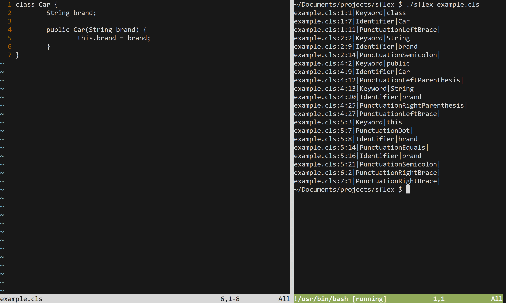

# Salesforce Apex Lexer

[Lexical analyzer](https://en.wikipedia.org/wiki/Lexical_analysis) for the [Salesforce Apex](https://developer.salesforce.com/docs/atlas.en-us.apexcode.meta/apexcode/apex_intro_what_is_apex.htm) Programming Language

TODO:
- [ ] utf-8 support
